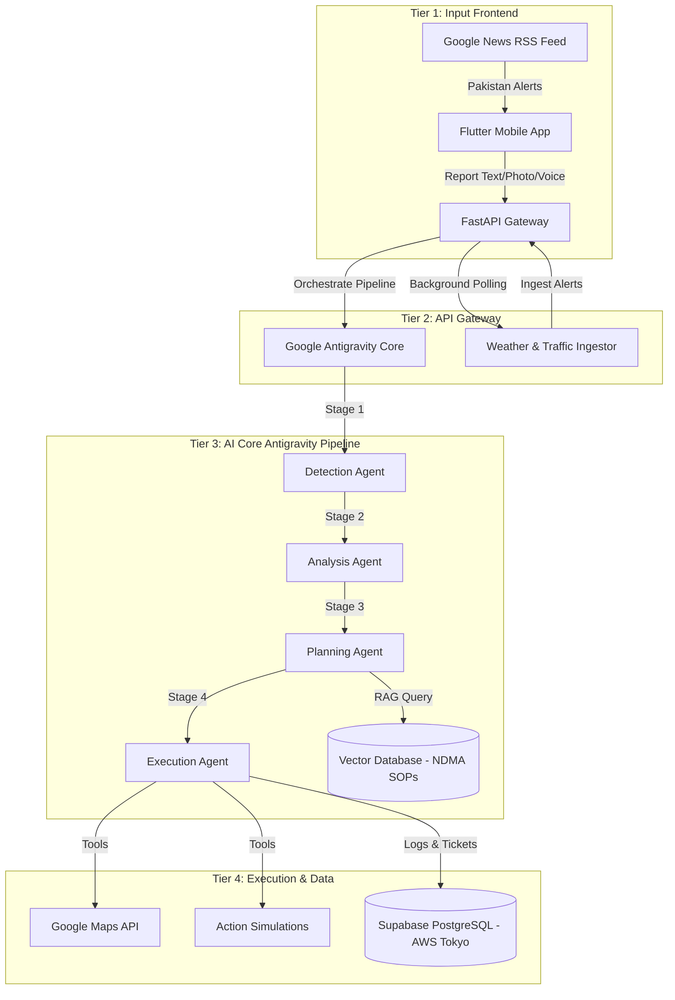

# 🚨 KHABAR (خبر) — Crisis Intelligence & Response Orchestrator (CIRO)
### **Powered by Google Antigravity & Gemini 2.5 Flash | AISeekho Antigravity Hackathon 2026 (Challenge 3)**

---

> **KHABAR** (Urdu for *News* or *Awareness*) is a production-grade Agentic AI Crisis Management platform built on the **Google Antigravity** orchestrator framework. It dynamically detects, analyzes, plans, and simulates responses to localized metropolitan emergencies (such as urban flooding, heatwaves, road blockages, infrastructure failures, and accidents) in Pakistan.

---

## 🏗️ 1. System Architecture (4-Tier Grid)

KHABAR integrates a reactive client architecture with an intelligent, server-side multi-agent coordinator:



---

## 🤖 2. The Google Antigravity 4-Agent Pipeline

The core orchestration is handled in a structured, sequential workflow, where each agent acts on the structured payload from the previous stage:

1.  **Stage 1: Detection Agent** (`detection_agent.py`): Parses informal, multi-lingual reporting signals (Roman Urdu, Urdu, English), categorizes the incident, and extracts geolocations.
2.  **Stage 2: Analysis Agent** (`analysis_agent.py`): Performs impact reasoning (stranded vehicles, affected population, nearby critical infrastructure assets).
3.  **Stage 3: Planning Agent** (`planning_agent.py`): Queries official **NDMA Pakistan SOPs** using RAG vector lookup and resource inventories to build a coordinated response action plan.
4.  **Stage 4: Execution Agent** (`execution_agent.py`): Directly invokes system tools to simulate responses and registers the complete "Before vs After" global state change.

---

## 📚 3. Detailed Feature Documentation

We have prepared comprehensive documentation files inside the `docs/` directory detailing every aspect of the project's features and engineering specifications:

*   **[Multi-Source Input Pipelines](file:///f:/khabar/docs/multi_source_input.md)**: Details on noisy text parsing (Roman Urdu), native Gemini voice transcription, and vision-based damage verification.
*   **[Multi-Agent Orchestration Pipeline](file:///f:/khabar/docs/multi_agent_pipeline.md)**: Deep dive into the four agent roles, payloads, and the sequential Antigravity reasoning chains.
*   **[Action Simulation Engine](file:///f:/khabar/docs/action_simulation.md)**: In-depth details on traffic rerouting corridors, emergency dispatches, and ticket/SMS warning logs.
*   **[Outcome Visualization & UI](file:///f:/khabar/docs/outcome_visualization.md)**: How the "Before vs After" changes are rendered in both client interfaces (Flutter and Web).
*   **[External API & Database Integrations](file:///f:/khabar/docs/external_integrations.md)**: Setup specs for Supabase PostgreSQL, Google Maps SDK, Open-Meteo weather loops, and news polling.
*   **[Firebase Cloud Messaging (FCM) Integration](file:///f:/khabar/docs/fcm_notifications.md)**: Guide on background handlers, global navigator state routing, and push warnings.
*   **[API Endpoints Reference Guide](file:///f:/khabar/docs/api_endpoints.md)**: Full REST API specs for all endpoints.

---

## 💻 4. Installation & Running Instructions

Ensure your machine is equipped with **Python 3.10+** and the **Flutter SDK** (v3.11.5 or newer).

### **1. Configure API Keys & Database**
Create or edit `agents/.env`:
```env
GEMINI_API_KEY=your_gemini_api_key
GOOGLE_MAPS_API_KEY=your_gmaps_key
DATABASE_URL=your_supabase_postgresql_connection_string
TOMTOM_API_KEY=optional_tomtom_key
```

### **2. Setup and Run the Python Backend**
Navigate to the root directory, activate a virtual environment, and install dependencies:
```bash
python -m venv venv
# On Windows Powershell:
.\venv\Scripts\activate
# On macOS/Linux:
source venv/bin/activate

pip install -r requirements.txt
```
Run the FastAPI Gateway server:
```bash
python api_server.py
```
*API will run on `http://127.0.0.1:8000`*

### **3. Start the Web Dashboard**
Open a new terminal tab, activate the virtual environment, and run:
```bash
python dashboard_server.py
```
*Open `http://127.0.0.1:8001` in your browser to view the Dark-Glassmorphic UI.*

### **4. Launch the Flutter Mobile App**
Ensure your emulator is running and connected to ADB:
```bash
flutter pub get
flutter run
```
> [!NOTE]
> Ensure `lib/api_config.dart` has the `baseUrl` pointing to `http://10.0.2.2:8000` if you are using the Android Emulator.

---

## ⚡ 5. Execution Traces & System Logging
*   **Persistent File Logging:** The backend automatically outputs complete execution logs to **`khabar_server.log`** on your disk.
*   **Web Console:** Every API request, agent reasoning decision, and simulated action is printed in real-time in the terminal window.
*   **Auditability:** The web dashboard features an **AI Agent Trace Logs** console widget to monitor live prompt executions by category (`[DETECTION]`, `[PLANNING]`, etc.) in real-time.

---

## 🏆 6. Key Innovations & Hackathon Highlights
*   **Regional Native Audio:** Bypasses Whisper entirely. Raw audio is processed directly through **Gemini Native Audio API** to support English, Urdu, and regional languages (Punjabi/Pashto).
*   **Proactive Weather Polling:** Uses geocoded Open-Meteo forecasts to automatically trigger heatwave or urban flooding warnings in the background without human intervention.
*   **Cloud-Native Data Core:** Built on a production-ready AWS Tokyo PostgreSQL database hosted on Supabase, replacing standard static mock files to sync resources instantly between sessions.

---

## 📝 7. Core Platform Assumptions
1.  **Map Corridor Simulations:** Due to API quota limits and routing complexities of rendering live routes via Google Maps, the detour corridor is visually simulated in the Flutter `MapScreen` using coordinate boundaries relative to the incident center.
2.  **Emergency Dispatch Capacity:** The system assumes a baseline resource capacity (WASA, Rescue 1122, K-Electric) in the database. In case of resource exhaustion, the Planning Agent automatically escalates incidents to `STANDBY` until units are released by the dispatcher.
3.  **Human-in-the-Loop Override:** While the pipeline is designed to be fully autonomous, P3-P5 priority events in production would require manual dispatcher confirmation before the Execution Agent triggers actual tool dispatches.
