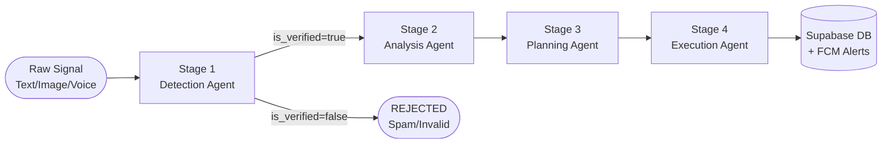

# 🤖 KHABAR Multi-Agent Orchestration Pipeline

KHABAR uses a **4-stage sequential multi-agent pipeline**. Each agent receives the previous agent's output as input and passes its own structured JSON output forward. All agents share a `SharedMemoryBlock`.

---

## Pipeline Flow



---

## LLM Chain (All Agents)

Every agent calls `LLMClient.generate_json()` which uses this 3-tier fallback:

```
AIML API (Gemini 2.5 Flash)  →  Local Gemma GGUF  →  Hardcoded JSON
         ↑                              ↑                     ↑
   agents/llm_client.py        agents/local_model.py   agents/llm_client.py
```

---

## Stage 1 — Detection Agent (`agents/detection_agent.py`)

**Purpose:** Read raw noisy input → classify → verify → assign priority.

**Input:** Raw text / voice transcript / image description + GPS coordinates

**Key Operations:**
1. Normalizes multilingual input (Urdu, Roman Urdu, English, Punjabi)
2. Classifies incident into types:
   - `URBAN_FLOODING`, `FIRE`, `ROAD_ACCIDENT`, `BUILDING_COLLAPSE`
   - `HEATWAVE`, `MEDICAL`, `ROAD_BLOCKAGE`, `INFRASTRUCTURE_FAILURE`
3. Extracts precise location (area, sector, city, lat/lng)
4. Assigns priority **P1** (life-threatening) → **P5** (low severity)
5. **Spam / Verification Gate:**
   - Rejects greetings, test messages, irrelevant content (`is_verified = false`)
   - Cross-validates weather claims against live Open-Meteo data
   - If flood claim + 0mm precipitation → `verification_reason = "Weather data contradicts report"`

**Output Schema (`DetectionOutput`):**
```json
{
  "incident_type": "URBAN_FLOODING",
  "priority": "P2",
  "confidence": 0.91,
  "is_verified": true,
  "verification_reason": "Corroborated by live precipitation data: 23mm/hr",
  "location": {
    "area": "Nullah Lai",
    "city": "Rawalpindi",
    "lat": 33.6375,
    "lng": 73.0784
  }
}
```

---

## Stage 2 — Analysis Agent (`agents/analysis_agent.py`)

**Purpose:** Reason about real-world impact — population, infrastructure, resources.

**Input:** Stage 1 `DetectionOutput` + Maps context (hospitals, ETAs)

**Key Operations:**
1. Estimates stranded vehicles, affected population density
2. Queries `MapsService` for:
   - Nearby hospitals with real Google Maps ETAs
   - Nearest WASA depot, fire station, rescue hub
   - Critical infrastructure at risk (power grids, water treatment)
3. Produces **bilingual** (Urdu + English) public warning text
4. Assigns severity score (1–10)

**Output Schema (`AnalysisOutput`):**
```json
{
  "severity_score": 8,
  "estimated_affected_population": 4200,
  "stranded_vehicles": 45,
  "nearby_hospitals": ["Holy Family Hospital (1.9 km, 7 min)"],
  "bilingual_summary": {
    "urdu": "راولپنڈی میں سنگین سیلابی صورتحال...",
    "english": "Severe urban flooding in Rawalpindi..."
  },
  "critical_infrastructure_at_risk": ["WAPDA Grid RWP", "Faizabad Interchange"]
}
```

---

## Stage 3 — Planning Agent (`agents/planning_agent.py`)

**Purpose:** Formulate an ordered coordinated action plan.

**Input:** Stage 2 `AnalysisOutput` + current `SystemState`

**Key Operations:**
1. **RAG Lookup:** Cosine similarity search against Pakistan NDMA SOP knowledge base to fetch applicable emergency protocols
2. **Resource Inventory Check:** Queries Supabase for available:
   - Ambulances, fire trucks, dewatering pumps, rescue teams, police units
3. Generates `RecommendedAction` list with:
   - `action_type`: dispatch / alert / reroute / ticket / status_update
   - `priority`: IMMEDIATE / HIGH / MEDIUM
   - `target_agency`: Rescue 1122 / WASA / Traffic Police / NDMA
   - `required_units`: integer count

**Output Schema (`PlanningOutput`):**
```json
{
  "action_priority": "IMMEDIATE",
  "response_strategy": "Multi-agency flood response — WASA + Rescue 1122",
  "recommended_actions": [
    {
      "action_type": "dispatch_rescue_team",
      "priority": "IMMEDIATE",
      "target_agency": "Rescue 1122",
      "description": "Deploy 2 rescue teams to Nullah Lai overpass",
      "required_units": 2
    },
    {
      "action_type": "broadcast_alert",
      "priority": "HIGH",
      "target_agency": "PUBLIC",
      "description": "Send bilingual flood warning via FCM"
    }
  ]
}
```

---

## Stage 4 — Execution Agent (`agents/execution_agent.py`)

**Purpose:** Execute the action plan using Antigravity tools. Track before/after state.

**Input:** Stage 3 `PlanningOutput` + current `SystemState`

**Key Operations:**
1. Maps each `RecommendedAction` to an Antigravity tool from `tool_system.py`
2. Executes tools in sequence, mutating `SystemState` after each
3. Tracks precise `before_state` → `after_state` difference
4. Generates realistic execution logs with timestamps
5. Sends real Firebase FCM push notification if `broadcast_alert` is in plan
6. Writes complete incident record to Supabase

**Available Tools (`tool_system.py`):**
| Tool | Action |
|---|---|
| `dispatch_rescue_team(agency, units)` | Deploys units, updates resource inventory |
| `allocate_supplies(item_type, quantity)` | Reserves medical/food supplies |
| `broadcast_alert(message, audience)` | Sends FCM push via `AlertService` |
| `update_traffic_route(close_road, detour)` | Updates closed roads & detours |
| `create_emergency_ticket(agency, details)` | Creates DB ticket for inter-agency |
| `query_knowledge_base(query)` | NDMA SOP vector lookup |
| `update_incident_status(new_status)` | Final status transition |

**Output Schema (`ExecutionOutput`):**
```json
{
  "final_outcome": "SUCCESS — All actions executed",
  "executed_actions": [
    {
      "action": "dispatch_rescue_team",
      "agency": "Rescue 1122",
      "success": true,
      "tool_results": [{"tool_name": "dispatch_rescue_team", "status": "OK", "output": {...}}]
    }
  ],
  "before_state": {"active_units": {"ambulance": 0, "rescue_team": 0}},
  "after_state":  {"active_units": {"ambulance": 2, "rescue_team": 2}},
  "system_state_diff": {
    "changed_keys": ["active_units", "closed_roads"],
    "descriptions": ["2 rescue teams deployed", "Murree Road section closed"]
  },
  "generated_alerts": [
    "⚠️ سیلاب کا خطرہ: راولپنڈی میں سیلابی صورتحال۔ فوری محفوظ مقام پر جائیں۔",
    "FLOOD ALERT: Flooding at Rawalpindi. Move to higher ground immediately."
  ]
}
```

---

## SharedMemoryBlock

All agents share a single `SharedMemoryBlock` per incident:

```python
class IncidentMemory:
    signal: RawCrisisSignal
    detection_output: DetectionOutput | None
    analysis_output:  AnalysisOutput  | None
    planning_output:  PlanningOutput  | None
    execution_output: ExecutionOutput | None
    system_state:     SystemState
    traces: List[str]   # timestamped log of every step
```

The orchestrator writes each agent's output to memory and passes it to the next stage, enabling full traceability.

---

## 🤝 Hybrid CrewAI Orchestration

The pipeline coordination is managed by a **CrewAI Sequential Crew** (`agents/crew_orchestrator.py`):

1. **Crew Setup:** Instantiates four CrewAI `Agent`s representing Detection, Analysis, Planning, and Execution.
2. **LLM Connection:** Configures a `crewai.LLM` object pointing to the AIML API endpoint:
   - **Model:** `openai/google/gemini-2.5-flash`
   - **Base URL:** `https://api.aimlapi.com/v1`
   - **API Key:** `AIML_API_KEY` (OpenAI-compatible)
3. **Task Coordination:** Four CrewAI `Task` objects run sequentially. Each task executes its corresponding custom agent's process as a synchronous tool execution wrapped in `asyncio.run()`.
4. **Context Passing:** Outputs of preceding tasks are seamlessly carried forward to subsequent tasks as context strings.

