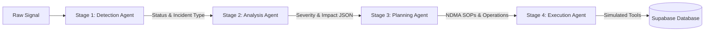

# 🤖 Multi-Agent Orchestration Pipeline

KHABAR implements a structured linear multi-agent workflow leveraging Google Antigravity design principles. Instead of a single model doing all tasks, the responsibilities are split into four discrete stages, passing structured JSON states downstream.

---

## 🔍 Stage 1: Detection Agent (`detection_agent.py`)
*   **Purpose:** Read noisy inputs, identify the core emergency signature, extract geo-coordinates, and estimate confidence.
*   **Input:** Raw text, voice transcription, or vision damage summary.
*   **Logical Action:** Parses the unstructured context and maps it to a strict classification schema (e.g., `URBAN_FLOODING`, `ACCIDENT`, `HEATWAVE`, `INFRASTRUCTURE_FAILURE`).
*   **Output:** Returns `incident_type`, `priority` (P1 to P5), `location` (latitude, longitude, area, city), and `confidence`.

---

## 📊 Stage 2: Analysis Agent (`analysis_agent.py`)
*   **Purpose:** Perform secondary reasoning to evaluate severity, estimate public impact, and find nearby infrastructure assets at risk.
*   **Input:** Output of Stage 1 + geolocated context.
*   **Logical Action:** Computes the overall impact metrics, including:
    - Number of stranded vehicles.
    - Size of the affected population.
    - Status of arterial roads.
    - Proximity to critical infrastructure (hospitals, power substations).
*   **Output:** Returns detailed severity analysis and bilingual Urdu/English public warning texts.

---

## 💡 Stage 3: Planning Agent (`planning_agent.py`)
*   **Purpose:** Formulate the official rescue and mitigation plan.
*   **Input:** Output of Stage 2.
*   **Logical Action:** 
    1. Triggers **Retrieval-Augmented Generation (RAG)** by performing a Vector Search against the Pakistan NDMA (National Disaster Management Authority) official emergency protocols.
    2. Compares the proposed action plan against local resource limits (Rescue 1122 ambulances, WASA dewatering pumps).
*   **Output:** Returns a list of structured operations (e.g., dispatch team $X$, set detour corridor $Y$).

---

## ⚡ Stage 4: Execution Agent (`execution_agent.py`)
*   **Purpose:** Execute the action plan by calling Antigravity Tools and computing the "Before vs After" global state change.
*   **Input:** Output of Stage 3 + current global system variables.
*   **Logical Action:** Directly invokes the tool system (`tool_system.py`) to trigger:
    - `UpdateTrafficRoute`
    - `DispatchRescueTeam`
    - `BroadcastAlert`
    - `CreateEmergencyTicket`
    - `AllocateSupplies`
*   **Output:** Returns the `before_state`, `after_state`, and writes the committed changes to the Supabase Database, triggering in-app FCM alerts.
